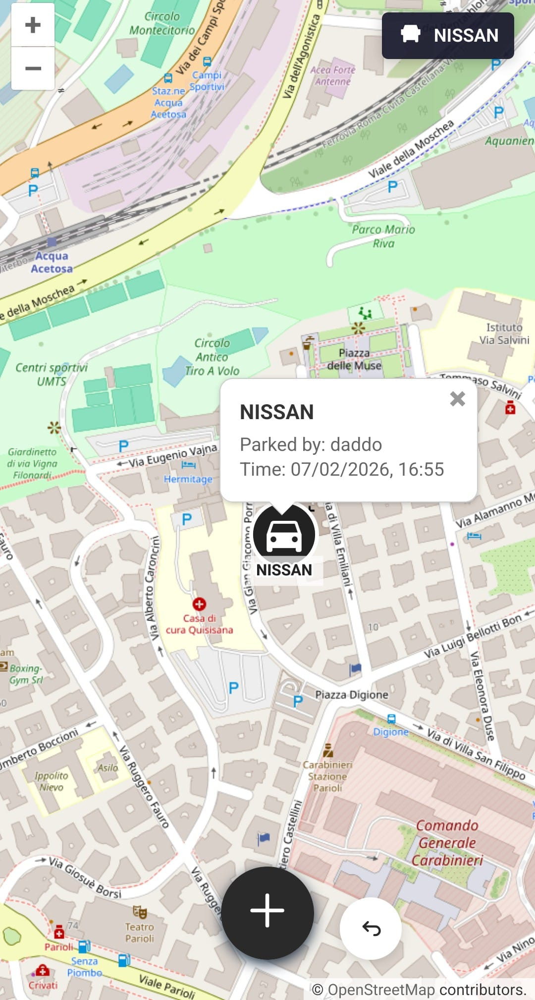

# Parky

[](https://openlayers.org/) 
[](https://fastapi.tiangolo.com/) 
[](https://tailscale.com/) 
[](https://www.python.org/) 
[](https://developer.mozilla.org/docs/Web/JavaScript)

A self-hosted web app to use as parking location tracker. 

It uses tailscale to avoid headaches with network configurations and security concerns about who can access the data. It really streamlines the usage.

## Features

- **Map-based tracking** - Pin your parking spot on an interactive map
- **Multi-vehicle support** - Track multiple cars
- **Shared access** - Family members can see where cars are parked
- **Undo support** - Rollback accidental saves
- **Metadata** about who parked where and when, with history tracking in the database


## Screenshots

<table>
  <tr>
    <td align="center">
      
    </td>
    <td align="center">
      
    </td>
  </tr>
  <tr>
    <td align="center"><em>Map View</em></td>
    <td align="center"><em>Vehicle Selection</em></td>
  </tr>
</table>

## Tech Stack

- **Frontend:** Vanilla JS + OpenLayers + Vite
- **Backend:** Python + FastAPI + SQLModel
- **Auth:** Tailscale IP-based user identification

## Getting Started

### Prerequisites

- Docker & Docker Compose
- Tailscale (for multi-user auth)

### Run

```bash
docker compose up
tailscale serve 9000
```

Tailscale will give the URL where the app will be accessible.

> **NOTE**: the app will ONLY be accessible from devices that are part of your tailnet.

## API

Interactive API docs available at `/scalar` when the backend is running.

## Database Schema
A single SQLite file with the following tables:
```
┌─────────────┐       ┌─────────────────┐       ┌─────────────┐
│    cars     │       │ parking_events  │       │    users    │
├─────────────┤       ├─────────────────┤       ├─────────────┤
│ id (pk)     │◄──────┤ car_id (fk)     │       │ id (pk)     │
│ name        │       │ user_id (fk)    │──────►│ name        │
│             │       │ latitude        │       │ tailscale_ip│
│             │       │ longitude       │       │             │
│             │       │ parked_at       │       │             │
└─────────────┘       └─────────────────┘       └─────────────┘
```
